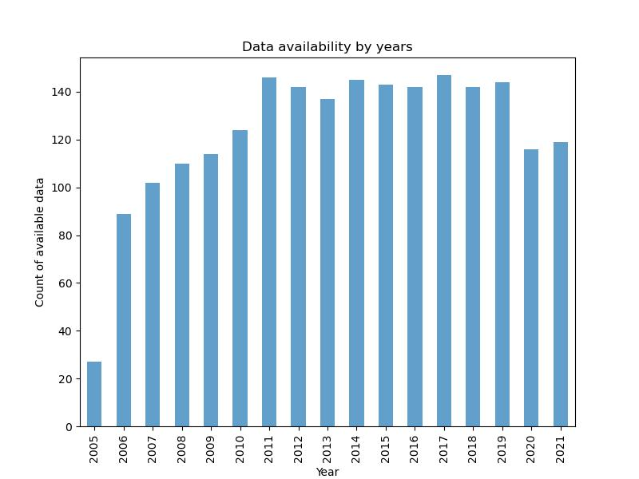
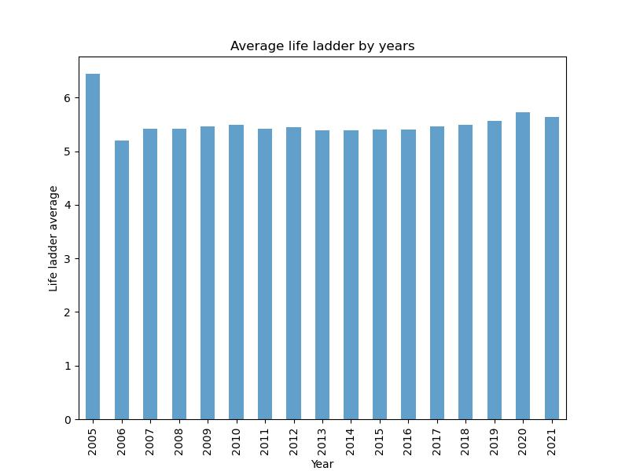

# Group 1 Project 1
Group 1 Project 1 Git Collaboration - Data Analytics Bootcamp

Team Members: 
Julia Begley,
Hasan Gokceoglu,
Isil Bulut,
Violetta Antonova

# Executive summary

The World Happiness Report is an annual publication that measures the happiness levels of countries around the world based on various factors such as economic growth, social support, freedom to make life choices, generosity, and trust in government and business institutions. The report provides valuable insights into the factors that contribute to the well-being of people and the overall happiness of a nation.

Overall, this dataset provides a valuable resource for researchers, policymakers, and anyone interested in understanding global happiness trends and the factors contributing to well-being.

# Questions to dataset
* What is the relationship between social support and generosity?
* Is there a positive relationship between happiness scores and their country’s healthy life expectancy?
* What is the relationship between confidence in the government, freedom to make life choices, and perceived corruption?
* How do these metrics differ globally or regionally?

# Data Cleanup and Analysis

We used Python to wotk with data. All our code is stored in Jupiter notebook. We used Pandas to read a csv file. Some of us renamed the column name for next usage and also cleaned data using dropna finction. Also we used group by function, to group data by Years or by Country name. As well, we defined function for drawing scatter plot with linear regression line and finding correlation.

After cleaning and completing grouping process we used Matplotlib to make charts. Using pyplot we were able to creat bar charts, scatter plots and maps. Also for presentation purpose we created WorldCloud chart with heart shape using our csv file Country name column.

We used API such as Geoapify that contains longitude and latitude for drawing map.

# Summary for dataset

The Word Happiness report data is available from year 2005 to 2021. As we can se from chart below for year 2005 we have small amount of data available, only 27 counties were participated in research, also for year 2006 only 89 countries take part in research.

The life ladder column represent data of people happiness. Respondents were asked to think of a ladder, with the best possible life for them being a 10 and the worst possible life being a 0. They are then asked to rate their own current lives on that 0 to 10 scale.

The chart below shows us average Life Ladder score from the year 2005 to year 2021. We can see that from year 2006 to 2020 our bar schart is slightly going up, but in year 2021 Life ladder score is dropping. Our assumptios was that people become less happier, because of Covid-19. Unfurtanetely it's not the main purpose of our project and this assumption could be gread start for the future projects.

Top 10 Happiest and 10 Unhappiest countries

Let's look at Top 3 most Happiest countries it's Denmark, Finland and Switzerland all the countries are located in Europe and two of them in Scandinavia.
3 less Happiest countries are Zimbabwe, Yemen, Comoros. Two of them are located in Africa and one close to Africa. So may be the cold weather makes people more happier, then worm climate, It's also great opportunity for future researches, because in The World Happiness report don't have any information about weather and how weather affect peoples happiness. But for sure We can state that in Europe and Scandinavian countries GDP per catita is more higher than in Africa.

# Life Ladder:

It asks respondents to think of a ladder, with the best possible life for them being a 10 and the worst possible life being a 0. They are then asked to rate their own current lives on that 0 to 10 scale.

**Healthy life expectancy at birth:**

Healthy Life Expectancy (at birth) is the average number of years a person would expect to live in good health in a particular area based on modern mortality rates in that area and prevalence of self-reported good health.

**Correlation Coefficient Ranges:**

### Question: Is there any coreleation between Life Ladder and Healthy life expectancy at birth?

As a first step,  we check the whole available data of World Happiness Report between 2005 and 2021 for "Life Ladder" and "Healthy Life of Expectance at Birth". Please see fig1

Correlation co-efficient value between Life Ladder and Healthy life expectancy at birth is: 0.71
This means Assotiation between Life Ladder and Healthy life expectancy at birth is very high

2- Secondly; for each country, we took the average values of "Life Ladder" and "Healthy life expectancy at birth" and again compare the values corelations.

Correlation co-efficient value between Life Ladder and Healthy life expectancy at birth is: 0.77
This means Assotiation between Average Life Ladder and Healthy life expectancy at birth is also very high

# Relationship of Freedom to make life choices and Perceptions of corruption with Confidence in national government.

How this data were collceted?

In each country people were asked about each part of their life. To collect data for Freedom to make life choice people were asked: Are you satisfied or dissatisfied with your freedom to choose what you do with your life? They must give an answer in between 0 and 1 and then country mean is calculated. Same process was with Perception of corruption - Is corruption widespread within businesses or not? and also for Confidence in national government - Is corruption widespread throughout the government or not?

Before to look at relationships of data I would like to look at each parameter by year to find what is going on overall. Corruption level that could be seen on chart on the right side - from year 2007 to year 2021 the corruption level is slightly going down. Three the most corrupted countries are: Romania (0.949), Bosnia and Herzegovina (0.942) and Bulgaria (0.938). Three less corrupted countries are: Rwanda (0.185), Qatar                 (0.183) and Singapore (0.101).

As we can see from the chart below on the left side - Average on Freedom to make life choices by years, that from year 2007 to year 2020 out chart is going up. So by the years people feel that they have more fredom to make choices, but in year 2021 the value drops down. I assume that it could be related with Covid-19 restrictions to travel around the worls and in the UK there were restrictions even to travel inside the country. Top three countries the most highest score are: Norway (0.952), Denmark (0.944) and Finland (0.941). Norway, Denmark and Finland are in top 10 less corrupted countries.

I'm not looking at the year 2005 and 2006, because in that years the amount of data available is relatively small and also less than 100 countries were participated in research.

Let's look at correlations.

<li><strong>Correlation between Freedom to make life choices with Confidence in national government. </strong>
  
As we can see from the plot that correlation between Freedom to make life choices with Confidence in national government is possitive, taht means that when Freedom to make life choices is going up, Confidence in national government is also going up. Correlation coefficient between this two variables is 0.4, that means that correlation is moderate.
  

  
<li><strong>Correlation between Perceptions of corruption with Confidence in national government. </strong>
  
As we can see from the plot that correlation between Perceptions of corruption with Confidence in national government is negative, taht means that when Perceptions of corruption is going up, Confidence in national government is going down. Correlation coefficient between this two variables is -0.46, that means that correlation is moderate.
  

  
  
 Correlations of Parameters
  
  
In order to see relationships between all variables a correlation matrix has been created and examined with each parameter and found out if the correlations are positive or negative, strong, moderate or weak. Then for easy understanding they have been color coded in a heatmap. Reds are positive, blues are negative correlations. Color fades from strongest to weakest. Diagonal line is the correlation of the parameter itself which is “1”. For instance, we can see how Life Ladder is strongly positive correlated with GDP per capita (0,79), Social Support(0,72), Healthy Life Expectancy at Birth(0,73), and Freedom to Make Life Choices (0,54) but (moderate to strong) negative correlated with Perceptions of Corruption (-0,48). 

  

 
Correlations with Life Ladder and other parameters also can be seen from below regression plots as increasing and decreasing lines and by looking at their slopes.
 

  
If we analyze the Generosity separately, we can see from above that surprisingly there is a very weak correlation with GDP per capita, or with social safety however Freedom to Make Life Choices has stronger positive effect. Same results can be seen from below regression lines which is nearly flat for social support (r=0.07) and linearly increasing with Freedom to Make Life Choices (r=0.4).
         
   

  
Analyzing Box Plots According to Years 

 

In order to create this box plot and to further perform Anova analysis, years 2005-2007 eliminated due to small sample sizes. 
•	According to these boxes 50% of the life ladder data are between 4 and 6 (8 is the highest finding). 
•	Negative outliners of Covid Years can be seen easily between 2019 and 2021. But despite Covid why is the world happier than years 2008 and 2011?
•	There are lower means in 2008 and 2011. Can the reasons be some world turmoils like, economic crises; high hitting oil prices, rapidly decreasing world trade, Wall Street anti low-income protest, China Earthquake (2008) that 60.000 people were dead, nuclear disaster at the Fukushima Nuclear Power Plant (2011) or Arab Spring (2011) that affected Tunisia, Egypt, Yemen, Bahrain, Syria and Libya. (www.peoplehistory.com)
•	Also, in 2010 and 2014 some relief in the world can be seen.
  
  
Is there a significant happiness change between 2008-2021
  
•	H0: There is no significant happiness score change from 2008 to 2021.
•	One-way Anova test has been applied. Since p (0.02) value < 0.05, null hypothesis has been rejected. There is significant happiness score change from 2008 to 2021 which causes more questions to ask and should be analyzed further.
 
 
                                                                 

Note: In order to see if the distributions are Normal, distribution plots have been used and have seen that they are more or less normally distributed. Examples are below:
Year 2019                                                  Year 2015                                            Year 2010
     
  

# Looking at happiness and Log GDP per capita by continent

For this analysis we used pycountry_convert to append continents to each country in the dataset, then we used grouped and sorted data to find the average Life Ladder and average Log GDP per capita per continent. The Log GDP per capita is a measure of country-specific forecasts of real GDP growth, after adjustment for population growth. These results are displayed in the bar charts above.
                                                                   
In these charts, we can see that the continents appear in the same order for both measures, which shows that those with higher average Life Ladder scores also have higher average Log GDP per capita. We can also see that Oceania* scores highest on both measures. Interestingly, South America and Asia have similar Log GDP per capita but South America has a more noticeable difference in Life Ladder score
                                                                   
*Oceania includes the following countries and territories: Australia, Papua New Guinea, New Zealand, Fiji, Solomon Islands, Micronesia, Vanuatu, Samoa, Kiribati, Tonga, Marshall Islands, Palau, Tuvalu, Nauru, New Caledonia, French Polynesia, Guam
Northern Mariana Islands, American Samoa, Cook Islands, Wallis & Futuna, Niue, Tokelau                                                                                                                 
The continents show in the same order for both measures
North America, South America and Asia all have similar Log GDP per capita, but Asia has a noticeably lower average Life Ladder score than we might expect compared to the Americas. It would be interesting to explore this further.

There were 2 key issues with obtaining and organinsing this data. The first was that the dataset provided did not include continents and so these needed to be appended for analysis. The second was that the process for appending the continent required that the country names matched a specific list in the pycountry_convert database, which was not the case for all countries in this dataset. For example, pycountry_convert has Congo and The Democratic Republic of the Congo, while the dataset used the capital cities to differentiate - Congo (Brazzaville) and Congo (Kinshasa). This also meant that some newer, but internationally recognised, countries and territories may have been incorrectly labelled in our dataset or the pycountry_convert database.                                                         

# Mapping happiness and Log GDP per capita globally

                                                       
These choropleth maps were generated using plotly express and show heatmap-style distribution of average Life Ladder score and average Log GDP per capita, by country. Dark blue represents higher scores, white are mid scores, Dark red represents the lowest scores.
                                                                   
Our expectation was that Log GDP per capita would have a significant and consistent impact on happiness scores. What stands out when comparing these maps is that there is quite a lot of difference between the two, showing that the relationship between average Life Ladder score and average Log GDP per capita is a more complex and varied one that we thought. Multiple countries have very low average Log GDP per capita but higher average Life Ladder scores.
                                                                   
It is useful to see the data in this map format to see how varied the scores are across the globe. We know from the correlation matrix that there is a high correlation between these 2 factors, these maps show that there is greater complexity to be found.                                                                   
                                                                   
# Results and Conclusions
                                                                   
                                                                   
•	The things we would expect to increase happiness (like a higher healthy life expectancy at birth, social support, or freedom of make life choices), did increase happiness.
                                                                   
•	Confidence in governments and corruption has strong effect on freedom of make life choices which is strongly related with happiness. The happiest countries are (Norway (0.952), Denmark (0.944) and Finland (0.941) also  among the top 10 less corrupted countries.
                                                                   
•	Most happy continents are Oceania and Europe, despite South America and Asia’s GDPs are close to each other, South America seems happier. It was surprising that GDP per capita didn’t have a stronger influence on happiness or generosity (again money is not everything).
                                                                   
•	Happiness score changes significantly over time. It is interesting to find out the world was happier during Covid years compared the years 2008-2011. Deeply examining the reasons of the changes over the years can be subject to  another study.

                                                                   
                                                                   
                                                                   
                                                                   
                                                                   
                                                                   
                                                                   
                                                                   
  
